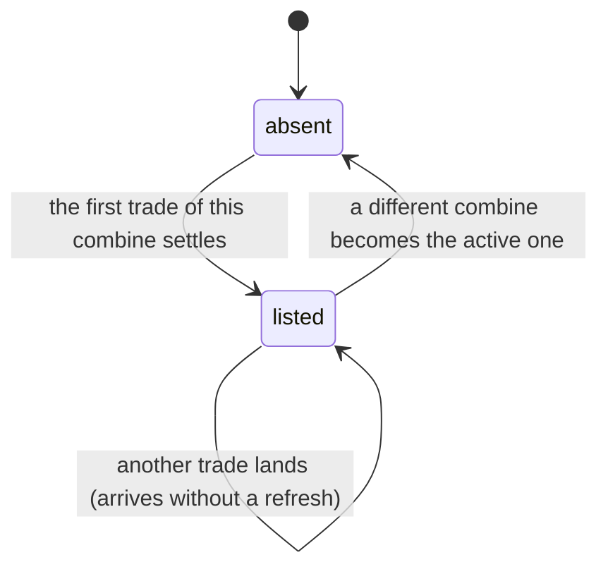

# The trade feed

## Summary

When a trade completes, one sentence about it lands on every phone in the league.
That sentence is the whole of what anybody outside the trade is told, and what it
leaves out is more carefully decided than what it says.

It names the two people. It counts the roster cards each of them handed over. It
names the secret cards by name — and that is the widest the record has ever been
allowed to get. No art, no flavour text, no *look*, no *level*, no finish, and
nothing whatsoever about a card nobody has traded. The set of secrets that exist
is the one number this app withholds everywhere, and a public record of trades is
the obvious place for it to leak out. It does not.

## The simple case

At the bottom of [the Trading Post](the-trading-post.md), under "Around the
league", is a bordered panel that scrolls. Each line reads like this:

> **ALICE ACE** sent **2 cards** to **BOB BLITZ** for **Gary the Grill**

The two names are the players. The parts in between are what moved, lit up in the
accent colour so the sentence reads as three facts rather than one grey run of
text. Newest at the top.

That is the entire feature. Nothing on the line is tappable, nothing expands, and
there is no way to ask it for more.

| What a line carries | What it never carries |
| --- | --- |
| Who proposed and who accepted | Which copy, of the several either of them might hold |
| How many roster cards each side gave | The finish on any of them — platinum, gold, or standard |
| The name of each secret that changed hands | A secret's art, flavour, look or the level of that copy |
| The order it happened in — newest first | Any trace of a card nobody has traded |

The inversion in that table is worth saying out loud, because it reads backwards:
the *public* card is counted and the *secret* one is named. A roster card is
public data anybody can already browse, and it is counted only because the
sentence is assembled without the roster in front of it — turning a card's
identity into a person's name is a lookup this particular piece of writing cannot
do. A secret's name is written into the record at the moment the trade settles,
by the one piece of the app that has both the card and the permission to read it.

> Technical note: the record is a snapshot taken when the trade completes, not a
> live lookup. Rename a secret card afterwards and every line already in the feed
> keeps the old name.

## The interaction, event by event

### Arrive

The feed is fetched for the active combine, newest first, capped at
twenty-five lines. The panel appears only when there is at least one; a league
that has not traded yet sees no heading and no empty box, on the same reasoning as
every other absent shelf in this app.

The names on each line are resolved on the phone, from the combine's roster and
from the list of claimable players. Anybody neither list can name reads as
"Someone" rather than as an identifier.

The data behind it asks for no identity at all — a completed trade is an
announcement, and the table it lives in is readable by anyone. In practice only
members ever see it, because the screen it sits on is member-gated. That is a
property of where it was put, not of what it protects.

### Leave without acting

Nothing is recorded. There are no read receipts on a feed, nothing is marked
seen, and neither party to any trade learns that you read about it.

### The tap that starts something

There is not one. This is the only band on the Trading Post with no control in
it: no line is a link, nothing opens, and nothing about a line can be asked for
in more detail. The write that fills the feed is somebody else pressing Accept,
described in [answering an offer](answering-an-offer.md).

### While it runs

The feed is live. Completed trades are the one trading table published to
realtime, and an insert into it redraws this panel on every connected phone —
including the phones of people with no stake in the trade at all, whose public
"packed by" counts have genuinely moved.

Pending offers are not published and never will be. Publishing that table would
make every card named in every open offer readable by anyone with a browser, so
the only thing the league hears about is a trade that has actually finished.

### It settles

The new line is at the top of the panel. Nothing announces it and nothing scrolls
to it; it is simply there the next time anybody looks.

Nothing about the line changes afterwards. It is written once, at the moment the
trade completes, and never updated.

## Modifiers

| Modifier | At arrival | Changed during |
| --- | --- | --- |
| Who you are (guest · member · account · commissioner) | The feed itself asks for nobody. What it says is identical for everybody who can see it, including the two people in the trade — they read the same redacted line as the rest of the league, and see the detail on their own receipt instead. Only a member reaches the screen. | No effect. Claiming a player or signing in changes nothing about a line. |
| The event's state (before the combine · running · finished) | Scoped to the active combine. Trades from a previous year do not appear, and outside an active combine the panel is absent entirely. | A combine ending does not clear the feed; a *new* one becoming active empties it, because it is asking about a different event. |
| Dust switched on or off | No effect. Marketplace sales are not trades and never appear here. | No effect. |
| The device (phone · desktop · reduced motion · presentation mode) | A short scrolling panel, sized so it cannot push the rest of the screen off a phone. | No motion of any kind, so reduced motion changes nothing. Under presentation mode the whole screen is inert. |

## Cancel and interrupt

| Event | Before a trade lands | After it lands |
| --- | --- | --- |
| Back, or closing a sheet | Nothing to cancel; the feed is a list. | The line is already written. There is no way for either party to withdraw or amend it. |
| Navigating away inside the app | No effect. | The line is on the server; it is there when you come back. |
| Reload | The same list comes back. | The same list comes back with the new line on it. |
| Backgrounded | No effect. | A phone that was asleep gets the new lines on its next window focus even if the live channel dropped. |
| Network lost mid-request | The panel keeps showing whatever it last loaded, or is absent if it never loaded. | Nothing new arrives until the connection returns; then the whole list is re-read rather than patched. |
| The request fails or times out | The panel is absent rather than showing an error. A league with no trades and a league whose feed failed look the same. | Same. |
| The token expires or is cleared | No effect on the feed, which needs no token — but the screen around it does, so it disappears behind the gate. | Same. |
| Changed by someone else | This is the only way the feed ever changes. Somebody else's accept is what writes a line. | Another trade lands under the first one. |
| A second tab or device | Identical on both. There is nothing per-device about it. | Both redraw. |
| Reduced motion or presentation mode changes | No effect. | No effect. |

## Interactions with other systems

**Who you have to be.** Nobody, for the data. The completed-trades table is
public by design and its summaries are safe by construction — the redaction
happens once, when the trade is settled, rather than being filtered out on the
way to a reader. That ordering is the point: there is nothing for a future change
to this screen to forget to hide.

**Realtime.** The one published table in the whole trading feature. An insert
lands on every phone and does double duty: it draws the new line, and it tells
both parties' devices that their collections just changed.

**Offline and reconnection.** The last loaded list stays on screen. Reconnecting
re-reads the whole thing rather than merging — with thirteen people the refetch
is cheap and cannot drift.

**Optimistic updates and rollback.** None. Your own trade appears in the feed when
the refetch lands, a beat after the toast that told you it worked.

**The card economy.** The feed is the only public trace that a card moved between
two people. It deliberately does not say which copy or what finish, so it cannot
be used to track who holds the good print of anything. The public "packed by"
count that appears on a card's back is unaffected by trading altogether — a giver
always keeps a copy — so nothing in the feed contradicts anything on a card.

**Motion and sound.** None. A line appears; nothing animates and nothing chimes.

**Notifications and badges.** The feed lights nothing. The dot on the Trade tab
is about offers waiting for you, not about the league's activity.

**Sharing.** No line has a link, an image or a share affordance. The trash talk
this feed exists to start happens out loud, in a garden.

**The second device.** Identical everywhere. Nothing about the feed is per-device.

**Accessibility.** Each line is one list item and reads as one sentence; the
colour on the named parts carries no meaning that the words do not. The panel is
an ordinary scrolling region.

## Edge cases

- **A secret with no name.** Two ways to get one: a trade settled before the feed
  was taught to name secrets at all, and a card whose catalogue entry has since
  been deleted. Both fall back to counting — "a secret", or "2 secrets" — which
  is why the older wording is still in the app rather than dead code.
- **A mixed side.** Counts and names are joined with a plus: "2 cards + Gary the
  Grill". The roster count always leads.
- **An empty side.** If every roster card on one side has since been deleted, its
  items are dropped when the record is written and that half of the sentence reads
  "nothing". The line is still published.
- **A card renamed after the fact.** The feed keeps the name the card had when it
  was traded. The vault shows the new one. Neither is wrong; they are answering
  different questions.
- **A secret name containing a plus sign.** The sentence is assembled by joining
  its parts with " + " and taken apart again on the same string to colour them, so
  a card called "Salt + Pepper" reads as two separate highlighted pieces. Cosmetic
  only, and noted below.
- **No date on a line.** The feed says what happened and in what order, never
  when. A trade from three weeks ago sits under one from a minute ago with
  nothing on the page to tell them apart.
- **More than twenty-five trades.** The oldest fall off the bottom. There is no
  paging and no archive; the feed is a ticker, not a ledger.
- **A trade with no combine attached.** Trades made out of season carry no event
  and never appear in any feed, though they are recorded.
- **The two people in the trade.** They read the same line as everybody else. The
  detail — which copy, what finish, what level — lives on their own receipt in the
  strip above, visible to the two of them and nobody else.

## Open questions and verification

- That the naming is exactly a name and nothing more is asserted against real
  Postgres, including a check that no finish and no identifier of a copy appears
  anywhere in the stored summary. It has not been re-checked against the deployed
  database, which is the copy that actually matters if a migration ever re-creates
  the settle path from a stale definition — which is precisely how the naming was
  silently lost once before.
- The comment describing this rule in the source points at a migration filename
  that does not exist in the repository; the rule itself is in
  `20260827130000_name_traded_secrets.sql`. A reader following the pointer would
  find nothing.
- Whether a phone whose live channel dropped really picks the feed up on the next
  window focus was read from the query settings, not observed.
- Assumption: no other screen in the app renders the completed-trades table. None
  was found at this commit.

Verified against willyoubemyhero commit `b46f330`.
