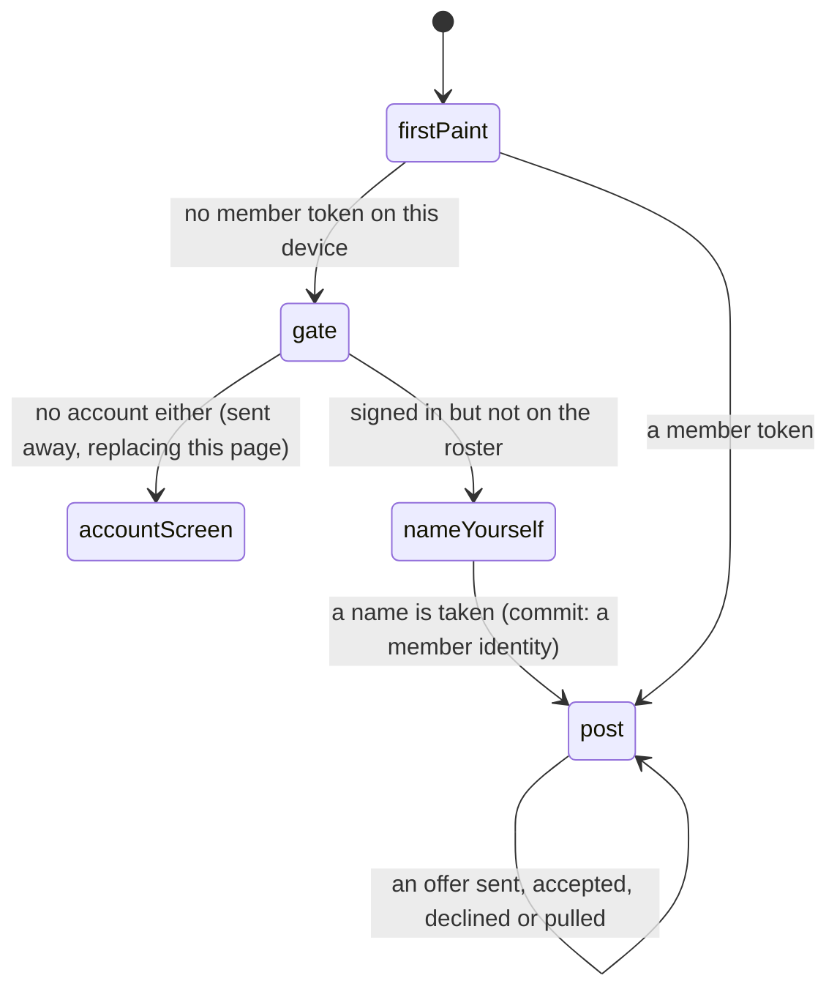

# The Trading Post

## Summary

The Trading Post is the third tab on the bottom bar and the only screen in the
app where two people's collections change at once. It has two live sides —
offers waiting on you, and offers you have put out — with a panel between them
for building a new one, a strip of receipts under that, and the league's public
record at the bottom. Everything on it is *member* business: a device with no
claimed player is shown a door rather than an empty inbox.

This document owns the screen. The three things you can do on it have documents
of their own: [making an offer](making-an-offer.md),
[answering one](answering-an-offer.md), and
[what the league is told afterwards](the-trade-feed.md).

## The simple case

You tap Trade. A band called "Waiting on you" sits at the top with a number
beside it. If somebody has offered you something it is there, full width, one
offer at a time — swipe sideways for the next, with a row of dots underneath
saying how many there are. If nobody has, the band says "Nobody wants your
cards. Yet."

Under it, "Make an offer": a row of names, one per person you could trade with.
Tap a name and two strips of cards open — yours and theirs — and a Send button
that stays dead until you have put at least one card on each side.

Below that, every offer you were part of that has settled lately reads as a small
receipt marked Done, Declined, Pulled or Expired. At the very bottom, "Around
the league": a scrolling panel of one-line sentences about every trade that has
completed this combine.

Offers you have sent appear in their own band, "Out there", between the inbox
and the compose panel — but only while you have one. An empty outbox is absent
rather than empty.

## The interaction, event by event

### Arrive

The screen asks for six things at once: the offers pointing at you and away from
you, the list of people you could trade with, what you have spare, the active
combine's roster and card art, the event's universal card back, and the public
feed. None of them blocks the others; each band fills as its answer lands.

The first paint is signed out for everybody, member or not. What the browser is
holding is read a beat after the first frame, which is why this screen in
particular reads its member token through a subscription rather than an effect —
the gate below used to fire in that one-render window and bounce a claimed member
to the sign-in screen. See
[identity and sessions](../foundations/identity-and-sessions.md#arrive).

Three doors, depending on what the device holds:

- **A member token.** Straight in.
- **An account, but no player.** A short form asking you to name yourself. You
  are a *collector*: nobody is ever going to hand you a paper code, and until you
  are named no offer can reach you. Naming yourself mints a member identity on
  the spot and the screen opens behind it.
- **Neither.** The app sends you to the account screen, replacing this page
  rather than stacking on it, with a line at the top saying trading needs an
  account because it is how the other player knows who they are swapping with.

Arriving is also what clears the dot on the Trade tab. Not a tap, not an
acknowledgement — the ids of everything currently in your inbox are marked seen
on this device the moment the list renders, because a dot that survived you
looking straight at the thing it points to would be worse than no dot at all.

> Technical note: seen offers are stored on the phone, not on your name. Read an
> offer on your handset and the iPad indoors still shows the dot. For thirteen
> people that was judged not worth a table.

### Leave without acting

Nothing reaches the server. No view is counted, no offer is marked read
anywhere anybody else can see, and neither side learns that you looked.

The one thing that *is* recorded is the dot going out, and it is recorded on the
device rather than on you. Backing out of the screen having decided nothing still
leaves the Trade tab clean until the next offer arrives.

### The tap that starts something

Most of this screen is free. Swiping between offers, tapping a name in the
compose panel, staging and unstaging cards — none of it writes anything, and all
of it is discarded when you leave. Switching to a different counterparty clears
both staged sides deliberately, because half of what you had staked was their
cards and those do not transfer to somebody else.

Four taps write, and each one is the subject of another document: **Send offer**,
**Accept**, **Decline** and **Take it back**.

### While it runs

The screen tracks one action at a time. The buttons on the offer being answered
dim; everything else stays live, so an offer landing in the inbox while you are
declining another one still arrives and still draws.

Nothing on this screen is optimistic. No card moves, no offer changes status and
no count updates until the server has said it happened.

### It settles

Whichever of the four you pressed, the screen then re-reads more than it strictly
needs: your offers, your spares, the counterparty's spares, the public feed, and
the three caches that describe your collection.

That last part is deliberate. The completed-trades table is published live, so
everybody else's phone hears about it — but the person who just pressed the
button is exactly the one who should not have to depend on that. Their channel
may still be joining, or realtime may be unavailable entirely, and their own
collection caches hold for a minute and five minutes respectively. Getting it
wrong would show somebody their pre-trade vault for minutes after the trade
landed.

## Modifiers

| Modifier | At arrival | Changed during |
| --- | --- | --- |
| Who you are (guest · member · account · commissioner) | The axis this screen turns on. A member gets the whole screen. An account holder who is not on the roster gets the name prompt. A guest with neither is sent to the account screen. A commissioner gets nothing extra — the console has no trading powers, and a commissioner who has not claimed a player cannot trade. | Claiming a player or naming yourself opens the screen in place, without a reload. A member token expiring closes it the same way. |
| The event's state (before the combine · running · finished) | No effect on the layout. It decides what there is to trade: outside an active combine there are no spares at all and no feed, so both strips read "No spares to trade" for everybody. | A card's tier changing mid-combine — somebody taking the lead — redraws the faces on every tile here, because this screen holds the combine's live channel like any other. |
| Dust switched on or off | No effect. Trading costs nothing and pays nothing. The bar underneath grows a Shop tab, which is the only visible difference. | No effect. The bar reflows under the screen; the screen does not move. |
| The device (phone · desktop · reduced motion · presentation mode) | Built for a thumb: offers are full width and swiped one at a time, and both card strips scroll sideways. Desktop gets the same layout in a wider column. | Reduced motion silences the flourish a completed trade earns. Presentation mode is only ever entered here by a set closing, which is a full-screen moment of its own. |

## Cancel and interrupt

| Event | Before the first write | After it |
| --- | --- | --- |
| Back, or closing a sheet | Everything staged is lost. Nothing is confirmed and nothing is warned about, because nothing was ever held. | The write is already gone to the server. Leaving does not stop it and does not undo it. |
| Navigating away inside the app | Same: staged cards are dropped and the counterparty selection with them. | The refresh that follows the write may land on a screen that is no longer mounted; the caches are updated regardless, so coming back shows the settled state. |
| Reload | Everything staged is lost. The inbox, outbox and feed come back from the server. The dot stays clear — that is on the device. | Same. The offer's new status is what the server holds, so a reload is a safe way to find out what actually happened. |
| Backgrounded | No effect. Coming back refetches the offers, which is how a locked phone catches up. | An in-flight write continues on the server whether or not the phone is watching. |
| Network lost mid-request | Nothing is in flight. The screen keeps drawing whatever it already loaded. | The important question, and the answer is that it may well have landed. The screen shows a failure; the refetch afterwards is what tells you the truth. |
| The request fails or times out | Not applicable. | A toast carrying the server's own sentence. Staged cards are left staged so the send can be tried again. |
| The token expires or is cleared | The gate takes over: the screen becomes the name prompt or the account screen, mid-visit. | The action fails rather than retrying — a member read here is set not to retry precisely so an expiry surfaces the door rather than three doomed attempts. |
| Changed by someone else | An offer arriving nudges this device and the inbox refetches; a trade completing anywhere redraws the feed and both spares strips. | Same, and it is how the other side of your trade finds out. |
| A second tab or device | Both show the same offers. Each keeps its own dot. | A trade accepted on one is visible on the other within a nudge or a window focus. |
| Reduced motion or presentation mode changes | No effect. | A set closing takes the whole screen for its ceremony; the trade itself is already done underneath it. |

## Interactions with other systems

**Who you have to be.** A member. Every write and every private read on this
screen begins with the same guard, and the participant id it works with comes
from the verified token rather than from anything the phone sent. The one id a
request legitimately carries is the *other* person's, and even that is re-checked
in the database against who actually owns what. Every write here runs with full
database privileges and bypasses row-level security, so that guard is the only
thing between the request and the tables.

**Realtime.** Two channels and one nudge. The combine's channel keeps the card
faces current. The completed-trades table is published, so a trade landing
anywhere redraws the feed and refreshes collections — including on the phones of
people who were not in it, whose public pull counts have genuinely moved. Pending
offers are *not* published and never will be: publishing that table would make it
readable by anyone, and an offer names cards both parties hold. What arrives
instead is a contentless nudge on a topic only you can be told; see
[notifications and badges](../cross-cutting/notifications-and-badges.md).

**Offline and reconnection.** The screen renders from whatever it last loaded and
every action fails with a toast. Reconnecting refetches on the next window focus.

**Optimistic updates and rollback.** None, anywhere in trading. There is nothing
to roll back because nothing is ever shown as done before it is.

**The card economy.** No dust is involved in a trade in either direction. It is
the one way a card moves between people at no cost. What the picker exposes about
each copy — the finish it wears, whether it is your last one — is the same
information [the mill](../dust/milling-and-selling.md) prices, but nothing here
spends or earns.

**Motion and sound.** A settled trade gets a small burst of confetti, at about
two-thirds the strength a good pack pull earns: a swap is a smaller moment than a
hit, but it is still a card arriving. If the trade closed one of your secret
sets, the burst is replaced by the full set-complete ceremony.

**Notifications and badges.** The dot on the Trade tab counts offers in your
inbox that this device has not displayed yet. Rendering the list clears it. The
vault also grows a small "Offer waiting" pill while the count is above zero,
because a dot under a thumb is easy to miss.

**Sharing.** Nothing on this screen is shareable. It has its own link preview
text — "Your dupes are somebody else's missing card" — for the case where
somebody pastes the URL.

**The second device.** Offers are per-person and identical on both. The dot is
per-device and is not.

**Accessibility.** Every card tile in the pickers is a toggle button reporting
its state, so a screen reader announces staging on the control that was operated.
A blocked card is not a control at all — it is marked disabled with its reason
read out beside it. The arrows between the two sides of an offer are decorative
and hidden. The tab's dot is hidden too; the wording on the tab carries the whole
message.

## Edge cases

- **Nobody to trade with.** If no other player has claimed a code or signed in,
  the compose panel says so rather than showing an empty row of names.
- **One offer.** The carousel collapses to a plain card with no dots. Two or more
  and the swiping starts.
- **An offer that lost a card.** If one of the staked cards has been deleted
  since, that side renders "Nothing left on this side." rather than a blank. The
  offer is still readable and still answerable; accepting one whose side has
  emptied out entirely marks it Expired rather than turning a swap into a gift.
- **Out of season.** With no active combine there are no spares, no feed and
  nothing to compose from, even though the rules would happily allow two people
  to swap secrets. The screen is open and empty.
- **A commissioner without a player.** The admin console does not make you a
  member. The gate treats them like anybody else.
- **Your own name.** Never appears in the counterparty row. The database refuses
  a trade with yourself as well, so both ends agree.
- **The receipts strip.** Holds the ten most recently settled offers in either
  direction, and is the only way a decline is ever seen — there is no message and
  no notification for one.
- **A phone handed around.** The screen is whoever the browser says it is. Two
  people sharing one handset share one inbox and one dot.

## Open questions and verification

- The "Claim your player" panel that appears while the account lookup is still
  answering is, on a device with neither identity, replaced by a redirect to the
  account screen a moment later. Which of the two a real visitor actually reads
  was not observed on a phone, and the account screen it lands on offers no route
  to the paper-code screen at all. This is flagged as a likely defect rather than
  described as a feature.
- The claim that the screen costs six parallel requests on arrival was read from
  the hooks, not measured, and several of them are usually cache hits from the
  vault.
- That the dot clears on render rather than on a tap was read from the effect and
  its position above the gate; it has not been watched on a phone.
- Assumption: no screen other than this one and the vault's pill links to the
  Trading Post. Nothing else in the source does.

Verified against willyoubemyhero commit `b46f330`.
